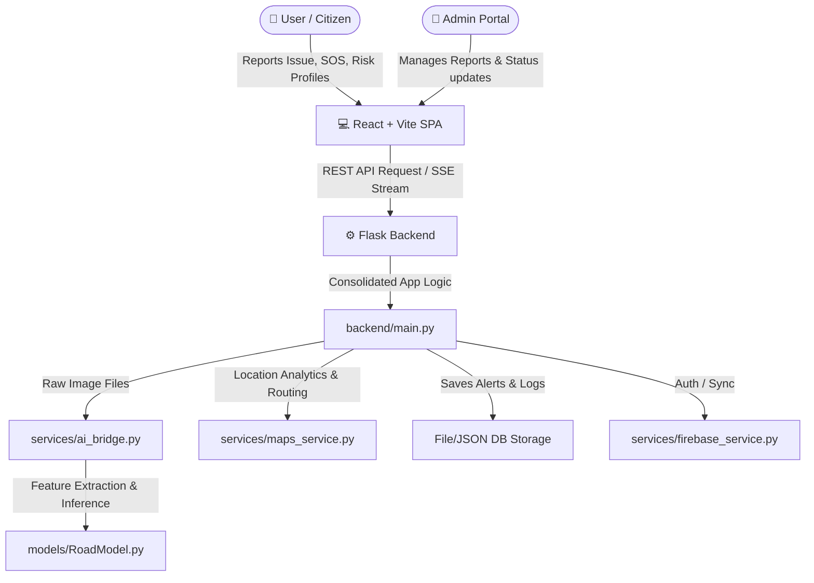

<div align="center">

# 🛡️ RAKSHA AI

**Intelligent Road Safety Ecosystem**

<p align="center">
  
  
  
  
</p>

> *"Preventing accidents. Saving lives. Empowering citizens through technology."*

[Key Features](#-key-features) • [Multilingual Support](#-multilingual-support-i18n) • [Architecture](#-architecture) • [Directory Structure](#-directory-structure) • [Installation & Setup](#-installation--setup) • [API Reference](#-api-endpoints)

</div>

---

## 🌍 The Problem

India records one of the highest numbers of road accidents globally. Major challenges include:

| 🚑 **Delayed Response** | 🚧 **Poor Infrastructure** | ⚠️ **Lack of Insights** | 🛑 **Low Awareness** |
| :--- | :--- | :--- | :--- |
| The critical "golden hour" is missed due to delayed emergency response and dispatcher latency. | Inadequate mechanisms for monitoring potholes, damaged roads, and missing signs in real-time. | Drivers lack real-time predictive hazard warnings on active routes. | Citizens lack simple, accessible platforms to report issues in their native languages. |

---

## 💡 The Solution: Raksha AI

**Raksha AI** is a unified, intelligent road safety ecosystem designed to address these problems through:
1. **Crowdsourced reporting** with instant localized feedback.
2. **AI-driven hazard classification** using computer vision features.
3. **Real-time route risk-profiling** and alert systems.
4. **Instant SOS rescue protocols** with automatic location coordinates dispatch.
5. **A command-center dashboard** for municipality and administrative actions.

---

## 🔥 Key Features

### 🚨 Smart SOS System
Generates emergency alerts with one tap. Supports automatic reverse-geocoding of coordinates, nearest hospital discovery, and fallback mechanism for dispatching details.

### 🛣️ AI Road Issue Detection
Snap and upload photos of road damage. The AI engine processes, classifies issues (e.g., Potholes, Waterlogging, Construction), and estimates severity ratings.

### 📊 Tactical Live Dashboard
A dark-mode, command-center style interface displaying active hotpots, recent incidents, real-time statistics, and Leaflet-based maps. Uses **Server-Sent Events (SSE)** to stream risk alerts in real-time.

### ⚠️ Route Risk Profiler
Analyzes a series of waypoints along a path and computes a real-time risk profile based on coordinates, time of day, weather, traffic levels, and reported hazards.

---

## 🌐 Multilingual Support (i18n)

Raksha AI features full localization across both the frontend and backend, breaking language barriers for citizens:

* **Supported Languages**: English (`en`), Hindi (`hi`), Tamil (`ta`), Telugu (`te`), Kannada (`kn`), and Malayalam (`ml`).
* **Frontend Localization**: Dynamic UI translation using `react-i18next` and a custom state provider (`LanguageProvider`). Automatically detects browser language and persists user preferences in local storage.
* **Backend Localization**: The REST API dynamically responds with localized status messages and alerts using the `localization_service`. Language is resolved via:
  1. URL Query parameter (e.g. `?language=ta`)
  2. `Accept-Language` header
  3. Default English fallback

---

## 🏗️ Architecture

Raksha AI uses a decoupled client-server architecture with an independent AI model evaluation module:



---

## 📁 Directory Structure

```
raksha-ai/
├── README.md                   # This file
├── docker-compose.yml          # Docker composition orchestrator
├── .env.example                # Example template for environment variables
├── ai-models/                  # AI/ML demo scripts and model files
│   ├── run_demos.py            # Integrated execution helper for AI models
│   ├── pothole_detection/      # Image feature-based classification pipeline
│   └── risk_prediction/        # Explainable tabular risk scoring model
├── backend/                    # Python Flask backend
│   ├── main.py                 # Core Flask entrypoint and unified route definitions
│   ├── config.py               # Settings and configuration loader
│   ├── models/                 # Lightweight models (RiskModel, RoadModel, SosModel)
│   ├── services/               # Services (AI bridge, Auth, Firebase, Maps, Reports, SOS)
│   └── routers/                # Deprecated prototype routers (kept for reference)
├── frontend/                   # React + Vite frontend SPA
│   ├── src/
│   │   ├── pages/              # Main routing views (Home, Dashboard, SOSPage, etc.)
│   │   ├── components/         # Reusable UI widgets and LanguageSelector
│   │   ├── i18n/               # i18n configurations and localized JSON translation files
│   │   └── context/            # Language Context Provider
│   └── vite.config.js          # Vite config (runs on Port 3000)
└── tests/                      # Automated test suite
    └── test_backend_routes.py  # Backend integration tests
```

---

## 🚀 Installation & Setup

### 🐳 Option 1: Docker (Recommended)
Launch the entire ecosystem (frontend, backend, and AI models) using a single command:

1. Clone the repository:
   ```bash
   git clone https://github.com/your-username/raksha-ai.git
   cd raksha-ai
   ```
2. Configure environment:
   ```bash
   cp .env.example .env
   ```
3. Run with Docker Compose:
   ```bash
   docker-compose up --build
   ```
*Access the Frontend at `http://localhost:3000` and the Backend at `http://localhost:8000`.*

---

### 💻 Option 2: Manual Run (Development)

#### 1️⃣ Start the Backend
1. Navigate to the backend directory:
   ```bash
   cd backend
   ```
2. Create and activate a Python virtual environment:
   ```bash
   python -m venv .venv
   # Windows:
   .venv\Scripts\activate
   # Linux/macOS:
   source .venv/bin/activate
   ```
3. Install dependencies:
   ```bash
   pip install -r Requirements.txt
   ```
4. Start the application:
   ```bash
   python main.py
   ```
*The backend server will run at `http://127.0.0.1:5000`.*

#### 2️⃣ Start the Frontend
1. Open a new terminal and navigate to the frontend directory:
   ```bash
   cd frontend
   ```
2. Install Node dependencies:
   ```bash
   npm install
   ```
3. Launch the Vite development server:
   ```bash
   npm run dev
   ```
*The React SPA will launch at `http://localhost:3000`.*

---

## 📡 API Endpoints

The Flask server hosts a unified REST API on Port 5000 (Port 8000 in Docker):

| Group | Endpoint | Method | Description |
| :--- | :--- | :---: | :--- |
| **System** | `/health` | `GET` | System health status & Firebase connection status |
| **Auth** | `/auth/register` | `POST` | Create a citizen user account |
| | `/auth/login` | `POST` | Authenticate citizen and retrieve Bearer token |
| | `/auth/admin/login` | `POST` | Authenticate admin user |
| | `/auth/me` | `GET` | Retrieve profiles of currently logged-in user |
| **Issues** | `/roads/issues` | `POST` | Submit a road hazard report (supports geo-coordinates) |
| | `/roads/issues` | `GET` | List submitted road issues with pagination and filters |
| | `/roads/issues/<id>` | `PATCH` | Update report status (Verified, In-Progress, Resolved) *(Admin only)* |
| **AI Detect**| `/roads/detect` | `POST` | Upload a road damage image to evaluate with AI Model |
| | `/roads/detect/<job_id>`| `GET` | Query the processing status or outcome of a detection job |
| **Risk** | `/risk/score` | `POST` | Compute risk score based on custom parameters |
| | `/risk/coordinate` | `GET` | Check hazard score for specific latitude/longitude |
| | `/risk/route-profile` | `POST` | Calculate risk indices for a set of path waypoints |
| | `/risk/stream` | `GET` | SSE (Server-Sent Events) live active risk alerts stream |
| **SOS** | `/sos/activate` | `POST` | Raise a critical SOS event (dispatches logs, pings hospitals) |
| | `/sos/alerts` | `GET` | Fetch list of active emergency alarms |

*To run automated backend integration tests, go to the backend and execute:*
```bash
python -m unittest discover -s ../tests
```

---

<div align="center">
  <b>Built for safety. Designed for impact.</b><br><br>
  <i>Maintainer: Saket Pathak</i>
</div>
